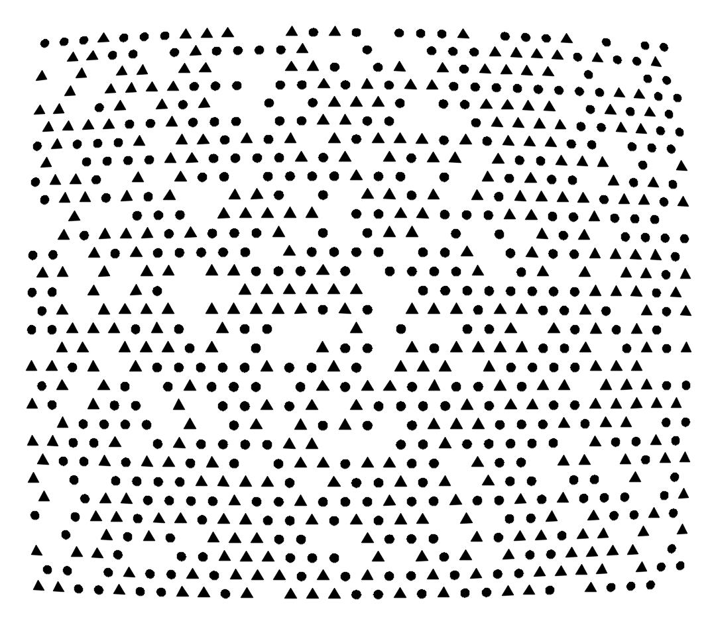
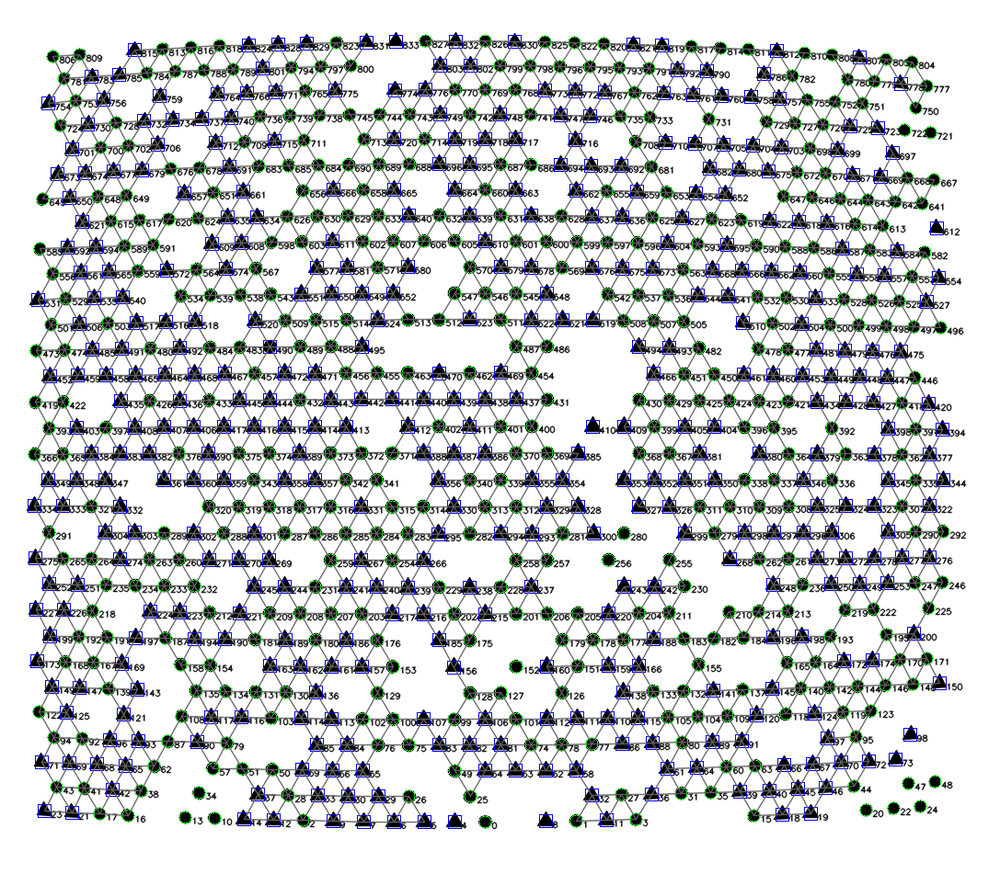
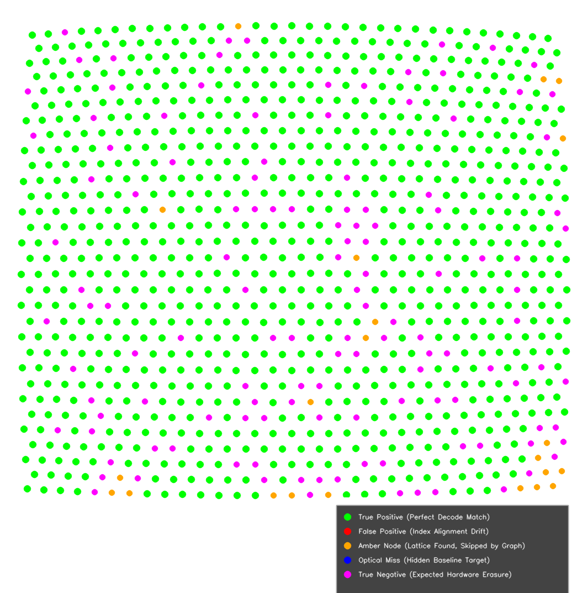

# Hexagonal Tracking Architecture

This document outlines the core computer vision phases of the Galois Field tracking framework.

---

## Core Algorithmic Steps

### 1. Optical Feature Extraction
The camera captures raw optical data of the physical calibration plate. A custom binarization and thresholding loop extracts the centers of the custom binary tokens (Circles and area-matched Equilateral Triangles) with high sub-pixel precision. Currently these image are simulated instead of extraction from real photo-images. Feature is a regular polygon (circle N > 100 and triangle N = 3) N can be easily calculated by contour simplification and used for feature type classification.

*Figure 1: Sub-pixel blob centers and feature classification extracted from the raw sensor frame.*

### 2. Transitive Wave-Growth Graph Synthesis
Starting from a validated high-confidence topological node seeds, a wave-growth clustering routine (`crystal.py`) traces out adjacent neighbor links across the hexagonal grid layout. The engine evaluates local triangular connectivity vectors dynamically, preserving the relative structural grid neighborhood networks even across high noise bursts.

*Figure 2: Active wave-growth propagation showing adjacent triangle mesh locks and topological links.*

### 3. 2D Tri-Axial Matrix Bit Construction

To understand exactly what the decoder reads, we must define how the 31x31 master pattern matrix is constructed. The 2D grid is not a random collection of tokens, nor is it a single wrapped 1D line. Instead, it is a **2D Pseudo-Random Phase Array** constructed by intersecting 3 independent 1D M-sequences along the continuous linear barycentric axes `u`, `v` and `w`.

To insulate the coordinate mapping pipeline from non-linear floor division traps (`// 2`) over signed negative boundaries, the engine unwarps discrete index addresses `(r, c)` straight into a flat, continuous linear barycentric `(u, v)` vector domain inside the main mapping loops:
- `v = r`
- `u = c - (r // 2)`

Because the spatial coordinate layout strictly enforces the invariant constraint `u + v + w = 0` at every node, this triple XOR formulation distributes perfectly balanced algebraic properties across the entire 2D lattice plane. This property makes barycentric axis interchangeable in easy way. 

Translations and 60-degree matrix rotations execute as pure transitive vector additions within this flat domain, eliminating horizontal row-parity shearing.
#### 3.1 The Underlying 1D Base Sequence
The pseudo-random binary sequence is governed by a 5-bit Linear Feedback Shift Register (LFSR) operating over the Galois Field GF(2). The bit generation follows a primitive characteristic polynomial of order $m = 5$, providing a maximum non-repeating period length of exactly:
$L = (2^5) - 1 = 31$ bits. Let $M$ be the canonical 31-bit maximum-length sequence array generated by the LFSR polynomial. This sequence is periodic, meaning:
$M[i] = M[i\space mod \space 31]$. This 31-bit array carries a unique property: any 5-bit sliding window sequence inside it reveals a completely unique local phase address.

#### 3.2 The Tri-Axial Base Sequences
For polynomial of 5th degree only 3 (and 3 dual) M-sequencies exist. Dual pair of sequencies is mutually reversible. So, every barycentric spatial direction can be encoded with own M-sequence. However, among the all of 6 M-sequencies intersections exist and minimal unique length is 11 bits.
Because of our hexagonal grid space is isotropic and possesses 3-axis symmetry, the absolute code phase is governed by three identical periodic base sequences mapped to the three continuous tracking axes:
- $U[u] = U[u\space mod \space 31]$
- $V[v] = V[v\space mod \space 31]$
- $W[w] = W[w\space mod \space 31]$

For any discrete storage matrix node sitting at index position `(row, col)`, the generator first extracts the continuous non-staggered linear barycentric parameters for all three symmetrical coordinate directions:
- v = row
- u = col - floor(row / 2)
- w = -u - v

The binary token state `B(row, col)` (0 for Circle, 1 for Triangle) stored in that specific matrix slot is calculated as the synchronized joint combination of all three line phases via a triple XOR intersection pass:
B(row, col) = U[u % 31] ^ V[v % 31] ^ W[w % 31]

#### 3.3 Why the Three-Diagonal Line Scanner Locks Perfectly
Any straight line scanned along any of the three directional axes preserves a flawless 1D decoding property. Because the 2D matrix structure is a linear combination of two 1D M-sequences, any straight line scanned across the grid preserves a valid 1D sequence. Interesting fact that scanning along a row, one can extract two axises simultaneously. Making differentiation with the nearest neighbor nodes (4 nodes in romboid) a bit sub-sequence sequence can be extracted with some phase shift.

By intersecting these two independently decoded lines inside `resolve_cell_index`, the system recovers the exact absolute coordinate intersections `(u, v)` anywhere on the pattern board, even if the camera only views a  13x2 fragment.

To uniquely anchor local coordinate tracking blocks to absolute locations on the master pattern board without scanning global references, the arrangement of custom binary tokens (Circles and area-matched Triangles) encodes phase shifts generated by a continuous Maximum-Length Sequence (M-Sequence).

### 4. Sliding Window State Reconstruction
When the continuous cross-axis line finders scan along any row, they extract a continuous sequence of binary tokens. 
- A circular geometric dot translates to a logical bit state of `0`.
- An area-matched triangle token translates to a logical bit state of `1`.

A sliding window of length $m = 5$ consecutive uncorrupted elements captures a unique 5-bit tracking primitive word vector `[b0, b1, b2, b3, b4]`. Because every distinct 5-bit combination appears exactly once per period, this state vector acts as a unique phase fingerprint. Actually we need more bits to isolate and evaluate the axis and some more bits for error detection.

The extracted 5-bit vector is passed straight into an algebraic lookup index or a Berlekamp-Massey syndrome register to evaluate its absolute phase shift position `k` relative to the sequence origin:
k = PhaseLookup(b0, b1, b2, b3, b4)

- The horizontal line decoder computes the canonical vertical parameter: `v_phase = k_hor`
- The vertical line decoder computes the canonical unwarped column parameter: `u_phase = k_vert`

By feeding these recovered phase scalars `(u_phase, v_phase)` directly into your `get_coordinates_from_phase` intersection modules, the core engine resolves the absolute `(row, col)` blueprint index matrix coordinates inside the 31x31 target panel with zero tracking ambiguity.

*Figure 3: The result grid overlay with color-coded node verification flags.*

