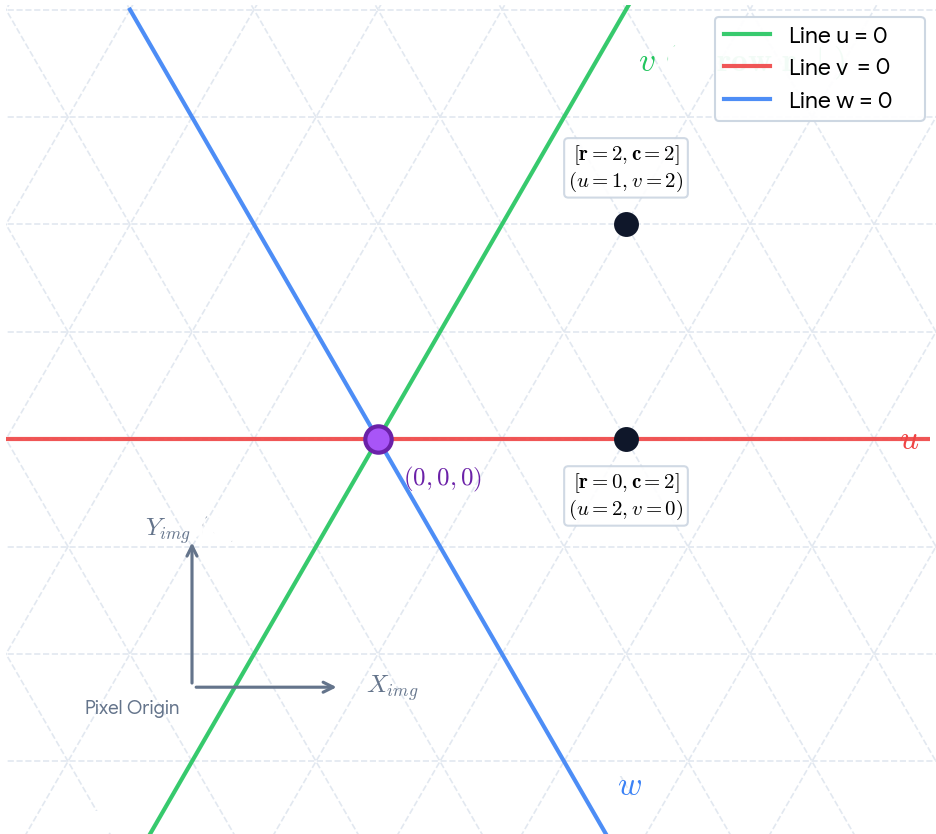

## Technical Interpretation of the Updated Zero-Lines Topology

By visualizing the Lines of Zero Values, we expose how the continuous barycentric constraint boundaries handle the spatial transformations cleanly when the grid moves upside down:

*Figure 1: Applied hexagonal grid and Barycentric coordinate space u + v + w = 0*

* Line $v = 0$ (Red Solid Line): Represents the physical baseline anchor where matrix row $r = 0$. Elements extending horizontally along this line match pure Cartesian translations.
* Line $u = 0$ (Green Solid Line): Represents the slanted baseline trajectory where column displacement parameter $u = 0$. Because it tracks downwards and to the right, it mirrors the exact skew angle of an un-staggered hexagonal grid.
* Line $w = 0$ (Blue Solid Line): The transverse diagonal vector line matching the condition $u = -v$. It locks down the invariant plane property $u + v + w = 0$ across both positive and negative spaces.

## Pixel Coordinates Translation ($X_{img}, Y_{img}$)
The grey reference frame in the corner shows the native orientation of your camera sensor. Because the matrix row counts increase downward ($Y_{img} \downarrow$) in standard computer vision buffers, aligning the green $v$ axis downward guarantees that your single-pass loop translations stay fully consistent with your image array indices without requiring unexpected vertical axis reflections.
You can save this updated, geometrically aligned plot into your repository docs folder as barycentric_zero_lines.png to give users a highly intuitive map of your linear tracking spaces.
Proactively propose a specific way to proceed: Let me know if you would like me to help you draft the formal algorithmic text block description for these zero-line transformations to insert directly into your ALGORITHM.md document!

### Section 3.1: Mathematical Formalization of the Linearized Domain

To eliminate the systemic column-shearing anomalies associated with non-linear floor division over signed coordinates (`// 2`), the framework maps discrete image-space matrix array storage indices `[r, c]` onto a flat, continuous three-axis barycentric vector field `(u, v, w)`. 

This coordinate mapping workspace defines row propagation downwards, maintaining strict algebraic symmetry with traditional computer vision pixel matrices (`X_img`, `Y_img` downward).

#### 1. Forward Unwarping Axis Equations
Every discrete cell index position is converted into the pure vector field upon loop entry:
- v = r
- u = c - floor(r / 2)
- w = -u - v

This unwarping plane ensures that the fundamental spatial invariant constraint is strictly observed across both positive and negative bounds:
u + v + w = 0

#### 2. Vector Translation over Isotropic Spaces
Because the `(u, v, w)` domain forms a flat isotropic vector field, geometric transformations such as bounding box translations or multiparametric shifts follow pure distributive, transitive vector subtraction laws:
- v_global = v_point_local - v_source_local + v_target_global
- u_global = u_point_local - u_source_local + u_target_global

#### 3. Topological Zero-Lines Map
The tracking space is governed by three continuous intersection tracking boundaries:
- Line v = 0 : The horizontal row baseline vector tracking along the pure column index lane.
- Line u = 0 : The 60-degree slanted downward-rightward baseline trajectory tracking the unshifted column plane.
- Line w = 0 : The transverse diagonal baseline separating the upper-right and lower-left tracking quadrants.

